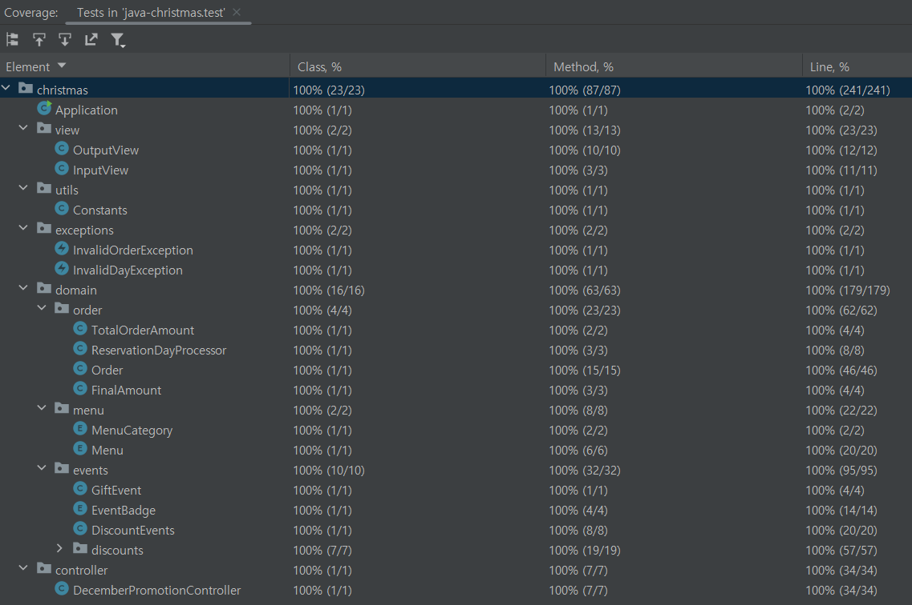

# 구현할 기능 목록

### 1. 사용자 입력 기능
- 사용자로부터 방문 예정 날짜 입력 받기
- 사용자로부터 주문할 메뉴와 개수 입력 받기

### 2. 입력 검증 기능
- 입력된 날짜가 1 이상 31 이하인지 검증
- 입력된 메뉴가 메뉴판에 있는 메뉴인지 검증
- 메뉴 개수가 1 이상인지 검증
- 메뉴 형식이 올바른지 검증
- 중복된 메뉴 입력 처리
- 총주문 금액이 10,000원 이상인지 검증
- 음료만 주문한 경우 주문 불가 처리
- 주문할 수 있는 메뉴의 최대 개수가 20개인지 검증

### 3. 할인 및 혜택 계산 기능
- 크리스마스 디데이 할인 계산
- 평일 할인 계산
- 주말 할인 계산
- 특별 할인 계산
- 증정 이벤트 계산

### 4. 결과 출력 기능
- 주문 메뉴 및 개수 출력
- 할인 전 총주문 금액 출력
- 증정 메뉴 출력
- 혜택 내역 출력
- 할인 후 예상 결제 금액 출력
- 12월 이벤트 배지 내용 출력

### 5. 에러 처리 기능
- 유효하지 않은 입력값에 대한 에러 메시지 출력
- 모든 에러 메시지는 "[ERROR]"로 시작하도록 구현

### 6. 단위 테스트 작성
- 모든 핵심 로직에 대한 단위 테스트 구현

---

## 프로젝트 구조
```
christmas/
├── controller/
│ └── DecemberPromotionController.java
├── domain/
│ ├── events/
│ │ └── discounts/
│ │   ├── decorators/
│ │   │ ├── AdditionalDiscountDecorator.java
│ │   │ ├── ChristmasDDayDiscountDecorator.java
│ │   │ └── SpecialDiscountDecorator.java
│ │   │ └── AdditionalDiscountDecoratorFactory.java
│ │   └── strategies/
│ │     ├── BasicDiscountStrategy.java
│ │     ├── WeekdayDiscountStrategy.java
│ │     ├── WeekendDiscountStrategy.java
│ │     └── BasicDiscountStrategyFactory.java
│ ├── menu/
│ │ ├── Menu.java
│ │ └── MenuCategory.java
│ └── order/
│   ├── FinalAmount.java
│   ├── Order.java
│   ├── ReservationDayProcessor.java
│   └── TotalOrderAmount.java
├── exceptions/
│ ├── InvalidDayException.java
│ └── InvalidOrderException.java
├── utils/
│ └── Constants.java
└── view/
  ├── InputView.java
  └── OutputView.java
```

---

## 주요 기능 설명

#### 전략 패턴
- 기본 할인: 주중 할인 / 주말 할인
- 위 기본 할인은 둘 중 하나가 반드시 적용되기 때문에 전략 패턴을 통해 지정

#### 데코레이터 패턴
- 특수 할인: 크리스마스 디데이 할인 / 특별 할인(별표 날짜 할인)
- 위 특수 할인은 조건에 따라 개별적용/비적용/중복적용이 나뉘기 때문에 데코레이터 패턴을 이용
- 기존 생성된 전략 객체에 데코레이터를 이용해 기능을 확장 가능하도록 설계

#### 팩토리 매서드 패턴
- 기본 전략 팩토리 매서드
  - 주중 / 주말 조건에 따라 알맞은 전략 객체 생성하는 팩토리 매서드
- 특수 할인 데코레이터 팩토리 매서드
  - 크리스마스 디데이 / 별표 날짜 조건에 따라 데코레이터 중복 적용해서 생성 가능한 팩토리 매서드
  - 기존 전략 객체에 데코레이터 

#### Custom exception
- 유지보수 시 비슷한 예외를 묶어 처리하고, 공통 로직을 일괄적으로 처리하기 위해 사용자 정의 예외 사용
- IllegalArgumentException을 상속받아 날짜 입력 예외, 주문 입력 예외 두 커스텀 예외 클래스를 생성
- 각 커스텀 예외 클래스에서는 공통적인 로직인 '[ERROR] ' prefix와 에러 메시지 출력 후 Line seperating을 일괄적으로 처리

#### 메뉴판 enum 클래스로 관리
- 메뉴판에 해당하는 상수들을 Menu라는 enum 클래스에서 관리하도록 함
- 각 메뉴 중 Category에 해당하는 상수는 따로 MenuCategory enum 클래스에서 관리하여 매직넘버를 최소화하고 유지보수성을 높임

#### 상수 분리
- 특정 클래스에서만 쓰이는 상수는 해당 클래스에 정의
- 여러 클래스에서 공통적으로 쓰이는 상수는 utils.Constants에 정의
- 이때 lineSeparator는 view단에서도 쓰이기 때문에 utils를 최상위 패키지에 위치시킴

---

## 테스트 커버리지
